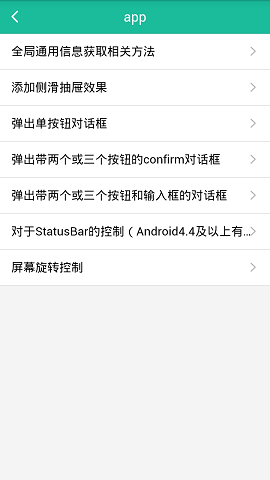
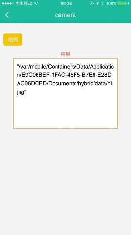

#369Cloud Demo

####集成JS-SDK、扩展功能、网络通讯及系统功能便于初学者学习使用

####第一步计划，持续更新JS-SDK内容。
####main目录下项目结构：
* /jssdk （JSSDK包含内容）
	* app_win.html（app 包含内容列表页）
	* /app
		* -alert.html （弹出单按钮对话框）
		* -audio.html  （Audio模块，部分功能，待更新）
		* -audio_player.html  （播放器页面演示Audio模块，部分功能）
		* -confirm.html （confirm对话框）
		* -get_methods.html （全局通用信息获取相关方法）
		* -prompt.html   （带输入框的对话框）
		* -rotate.html   （解锁屏幕翻转）
		* -slider_drawer.html  （侧边滑动页面）
		* -statusbar.html（app状态栏控制）
	* -accelerometer_win.html （加速度传感器模块）
	* -camera_win.html 		  （摄像头模块）
	* -contacts_win.html      （联系人模块）
* /extension（扩展功能）
	* actionssheet_win.html （底部弹出菜单模块）
	* app_pop.html          （全局通用信息获取相关方法）

扫码安装Demo: 
